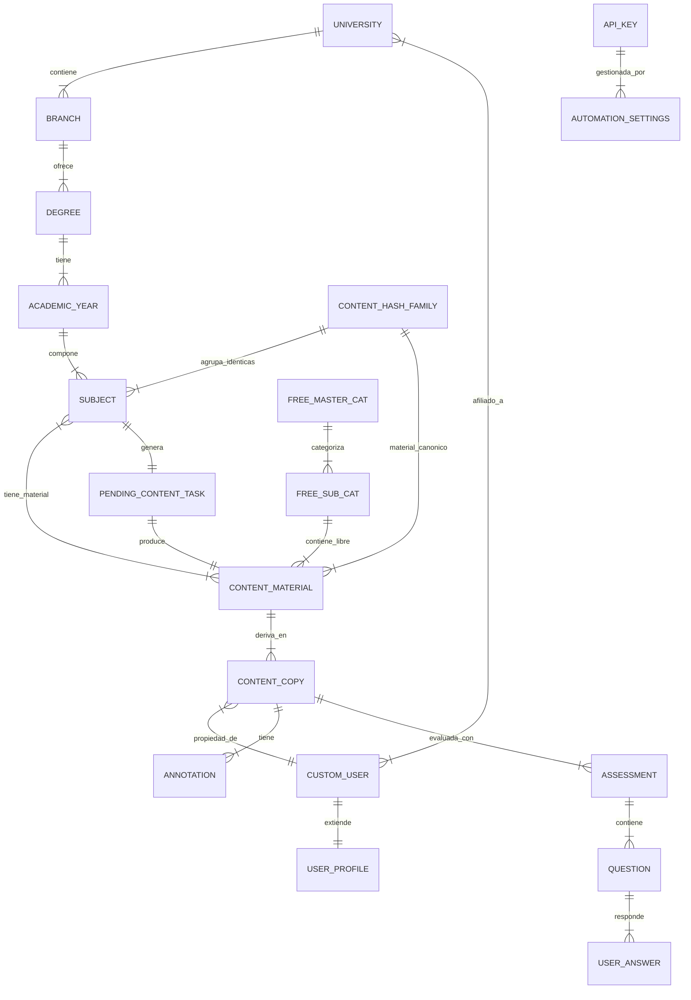

# Hito Final 2: Documentación de Proyecto ("La Enciclopedia Galáctica")

**Propósito:** Crear el compendio técnico definitivo y la fuente de verdad arquitectónica del proyecto CampuStudiOnline.
**Estado:** **EN PROGRESO**
**Última Actualización:** 28/11/2025

---

## 1. Manual de Arquitectura de Datos

La arquitectura de datos de CampuStudiOnline se estructura en cinco dominios interconectados pero con responsabilidades claramente delimitadas. Esta separación permite escalar la lógica de negocio de cada módulo sin acoplamientos rígidos.

### 1.1. Diagrama Conceptual de Alto Nivel

### 1.2. Dominio Académico (`academic_structure`)
Actúa como la columna vertebral y fuente de verdad de la oferta educativa.
*   **Jerarquía Estricta:** `University` -> `Branch` -> `Degree` -> `AcademicYear` -> `Subject`. Garantiza una navegación predecible.
*   **Deduplicación Inteligente (`ContentHashFamily`):** Resuelve el problema de asignaturas idénticas impartidas en distintos grados (ej: "Matemáticas I" en Física y Matemáticas). Agrupa múltiples entidades `Subject` bajo un mismo `hash` de contenido, permitiendo generar un único `ContentMaterial` compartido.
*   **Autonomía:** Los modelos son `TimeStampedModel` y gestionan sus propios `slugs` para URLs amigables SEO.

### 1.3. Dominio de Contenidos (`contents`)
El CMS híbrido que gestiona tanto material académico reglado como contenido libre.
*   **Dualidad de Contenido (`ContentMaterial`):** Un material puede pertenecer al mundo académico (vinculado a `Subject`) o al mundo libre (vinculado a `FreeContentMasterCategory` y `SubCategory`).
*   **Paradigma de Copia Privada (`ContentCopy`):** El usuario nunca interactúa directamente con el `ContentMaterial` original para estudiar. El sistema crea una `ContentCopy` personal, lo que permite aislamiento total para anotaciones (`Annotation`) y estado de lectura sin afectar al original ni a otros usuarios.
*   **Optimización de Navegación (`UserStudyNavigation`):** Modelo desnormalizado que almacena en JSON el árbol de carpetas y recursos del usuario para evitar consultas recursivas costosas en tiempo real.

### 1.4. Dominio de Orquestación (`orchestrator`)
El "cerebro" encargado de la generación de contenido mediante IA.
*   **Máquina de Estados de Tareas (`PendingContentTask`):** Controla el ciclo de vida de la generación (`PENDING` -> `PROCESSING` -> `COMPLETED`). Mantiene un log detallado (`task_log`) y fragmentos intermedios (`GeneratedContentChunk`) para recuperación ante fallos.
*   **Gestión de Recursos (`ApiKey`):** Sistema de rotación y cuarentena automática de claves de API de Gemini para manejar límites de cuota y errores de servicio.
*   **Singleton de Configuración (`AutomationSettings`):** Centraliza los interruptores globales y punteros de estado del sistema de automatización.

### 1.5. Dominio de Evaluación (`assessment`)
Motor de autoevaluación adaptativa.
*   **Vinculación Contextual:** Las evaluaciones (`Assessment`) nacen de una `ContentCopy`, asegurando que las preguntas se generen sobre el contenido exacto que el usuario está estudiando.
*   **Ciclo de Vida Complejo:** Soporta estados asíncronos para generación y corrección (`PENDING` -> `PROCESSING` -> `COMPLETED` -> `CORRECTING` -> `RESULTS_AVAILABLE`).
*   **Caducidad:** Implementa lógica de expiración para incentivar el estudio continuo (`expiration_date`, `results_expiration_date`).

### 1.6. Dominio de Usuarios (`users`)
Gestión de identidad y perfil extendido.
*   **Afiliación Verificada:** `CustomUser` mantiene una relación directa con `University` para validar la pertenencia institucional.
*   **Perfil Enriquecido (`UserProfile`):** Almacena metadatos sociales, preferencias de privacidad granulares y claves criptográficas (`public_key`, `encrypted_private_key`) para el sistema de mensajería segura end-to-end.

---

## 2. Referencia de Componentes (Aplicaciones Nucleares)

### `academic_structure`
*   **Responsabilidad:** Modelado de la realidad universitaria y normalización de datos.
*   **Clases Clave:** `University`, `Branch`, `Degree`, `Subject`, `ContentHashFamily`.
*   **Lógica Crítica:** Cálculo de hashes de contenido, generación de slugs únicos, determinación de estado público heredado.

### `contents`
*   **Responsabilidad:** Gestión, presentación y personalización del material didáctico.
*   **Clases Clave:** `ContentMaterial`, `ContentCopy`, `Annotation`, `FavoriteFolder`.
*   **Lógica Crítica:** Renderizado Markdown seguro (Bleach), gestión de jerarquías de carpetas (Treebeard), clonación de contenido para estudio.

### `orchestrator`
*   **Responsabilidad:** Coordinación de tareas asíncronas de IA y gestión de cuotas.
*   **Clases Clave:** `PendingContentTask`, `ApiKey`, `AutomationSettings`, `ContentRequest`.
*   **Lógica Crítica:** Algoritmos de reintento, rotación de claves en cuarentena, priorización de solicitudes de contenido.

### `assessment`
*   **Responsabilidad:** Generación y corrección de exámenes mediante IA.
*   **Clases Clave:** `Assessment`, `Question`, `UserAnswer`, `AssessmentSettings`.
*   **Lógica Crítica:** Orquestación de llamadas a IA para generación y corrección, gestión de tiempos límite, cálculo de puntuaciones.

### `users`
*   **Responsabilidad:** Autenticación, autorización y perfilado social.
*   **Clases Clave:** `CustomUser`, `UserProfile`, `ArchivedKey`.
*   **Lógica Crítica:** Gestión de grupos y permisos, cifrado de datos sensibles de usuario, control de cuotas de uso de IA por usuario.

---

## 3. Bitácora de Sesión

### 28/11/2025 - Documentación de Arquitectura
*   **Objetivo:** Redacción del Manual de Arquitectura y Referencia de Componentes.
*   **Acciones:**
    *   Análisis profundo de modelos (`models.py`) de los 5 módulos nucleares.
    *   Generación de diagramas E-R conceptuales.
    *   Documentación de flujos de datos y responsabilidades por módulo.
    *   Identificación de patrones clave (Singleton, Hash Family, Content Copy).
*   **Resultado:** Creación de la versión V13 completa del documento de hito.

### 27/11/2025 - Sesión de Hotfix Crítico (UX/Legal + Bugs 500)
*   **Resumen:** Intervención de emergencia para corrección de terminología ("Institución"), fix de error 500 en chats y limpieza de integridad referencial en base de datos.
